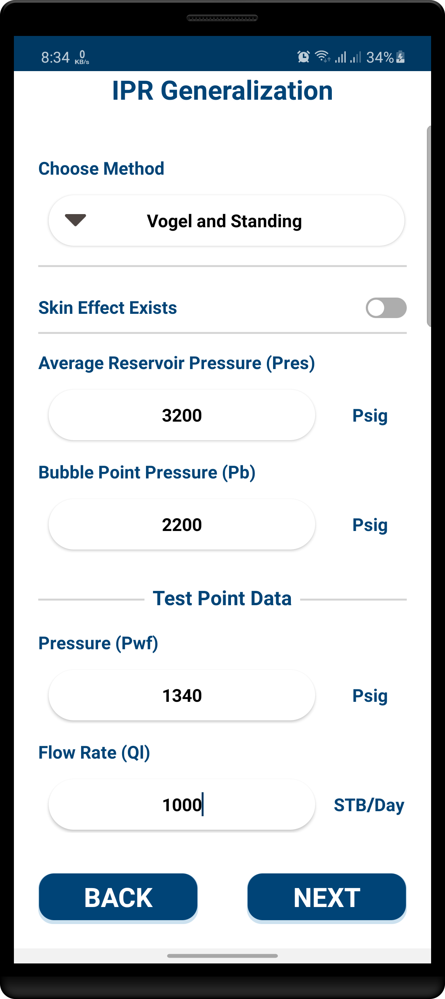
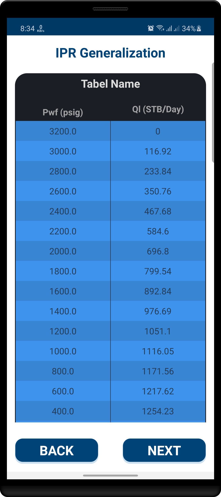
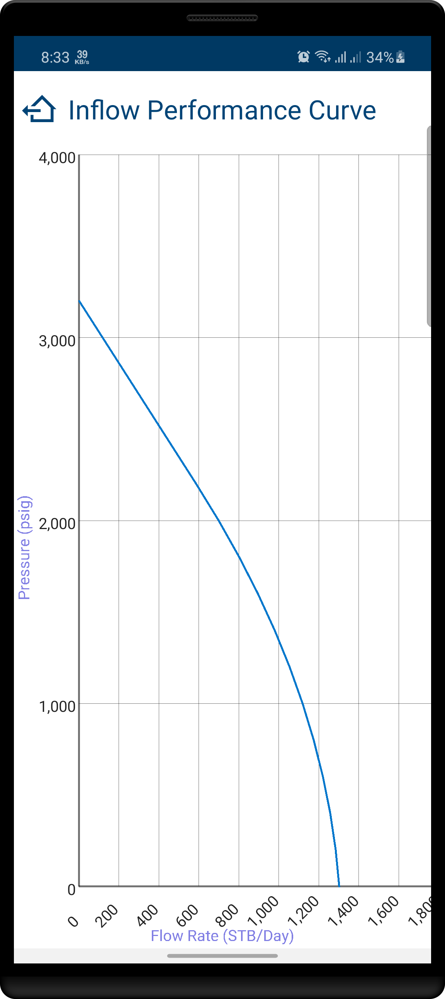
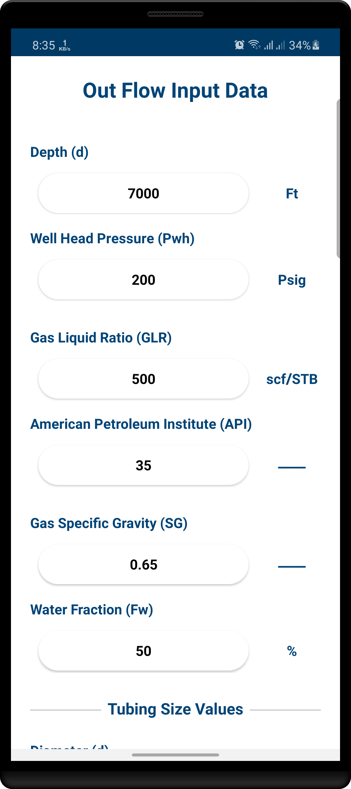
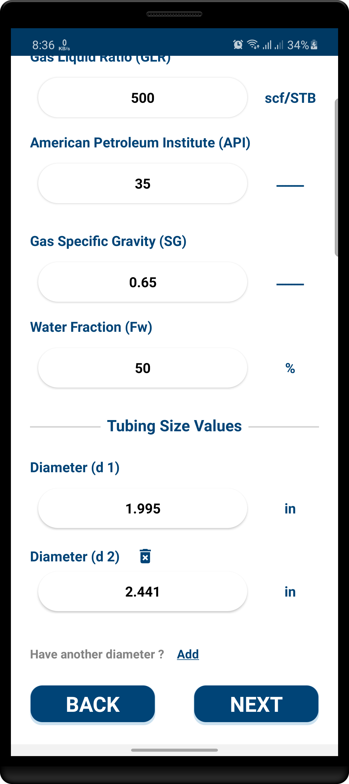
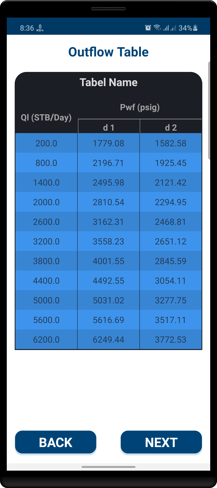
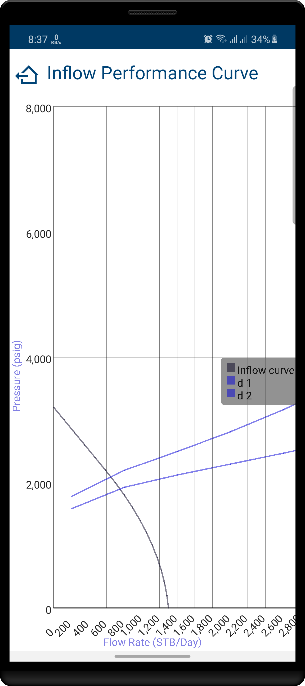

# Petroleum Oil and Gas Production App 
Calculate IPR and Travers curves that show the productive capacity and well performance and determine the pressure distribution and rates along oil and gas wells.

## IPR Curve
The app provides three methods to calculate the IPR curve
- **Vogel and Standing**
- **Fetkovich**
- **Jones et al**

## Travers Curve
You can get the Travers Curve Using the IPR data and outflow data
with different tubing size
- **1.995 inch**
- **2.441 inch**
- **2.992 inch**

## Test the app
you can use the values provided in the tables below to test the app.

### IPR Test

Using **Vogel and Standing** method with no skin Effect.

| Parameter                         | Value| Unit   |
|-----------------------------------|------|--------|
| Average Reservoir Pressure (Pres) | 3200 | Psig   |
| Bubble Point Pressure (Pb)        | 2200 | Psig   |
| Pressure (Pwf)                    | 1340 | Psig   |
| Flow Rate (QI)                    | 1000 | STB/Day|

### Travers Curve Test

Using **IPR data** above and the outflow data in the table below to get the travers cure.

| Parameter                          | Value | Unit |
|------------------------------------|-------|------|
| Depth (d)                          | 7000  | Ft   |
| Well Head Pressure (Pwh)           | 200   | Psig |
| Gas Liquid Ration (GLR)            | 500   | Psig |
| American Petroleum Institute (API) | 35    | none |
| Gas Specific Gravity (SG)          | 0.65  | none |
| Water Fraction (Fw)                | 50    | none |
| diameter (d1)                      | 1.995 | inch |
| diameter (d2)                      | 2.441 | inch |
| diameter (d3)                      | 2.992 | inch |
| diameter (d4)                      | ..... | inch |
| diameter (d5)                      | ..... | inch |

## ScreenShots

### IPR Curve

  
  
  

### Travers Curve

  
  
  
  

## Download
You can download the app from [here](https://raw.githubusercontent.com/m-tharwat262/PetroleumProduction/master/apk/Petroleum_Production.apk)

